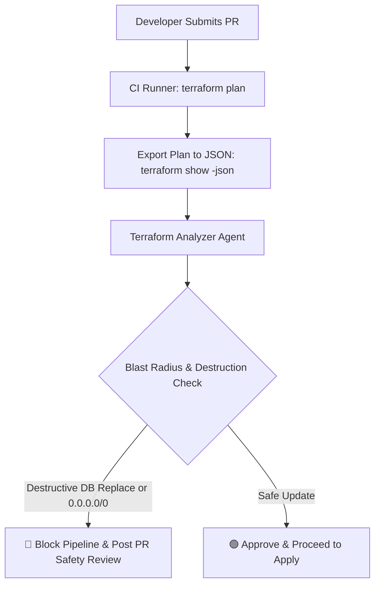
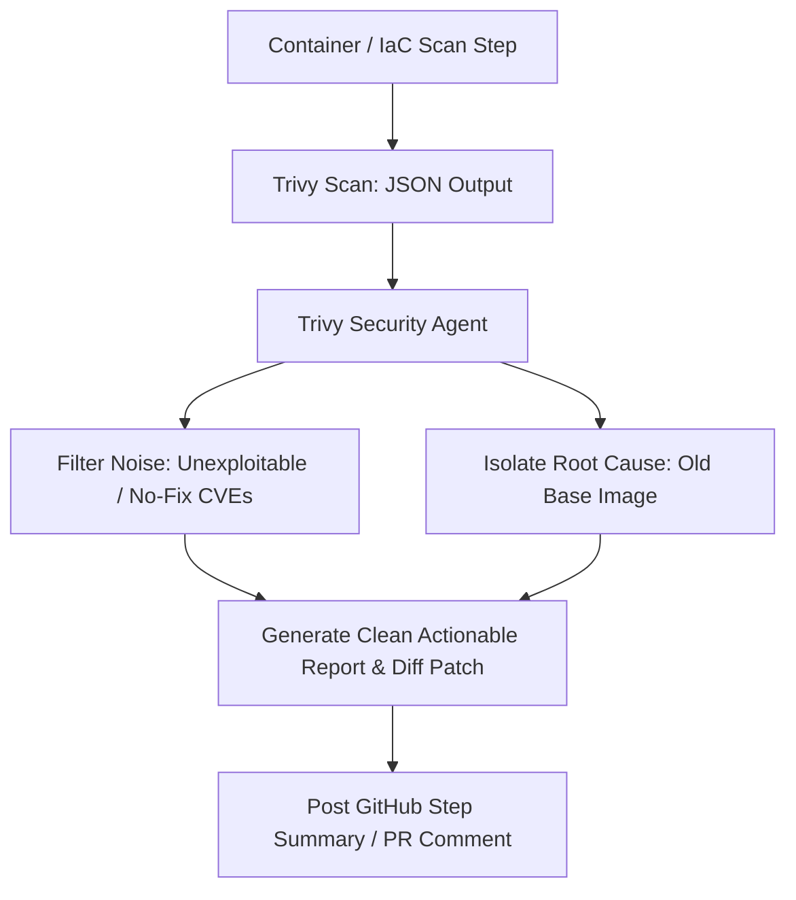
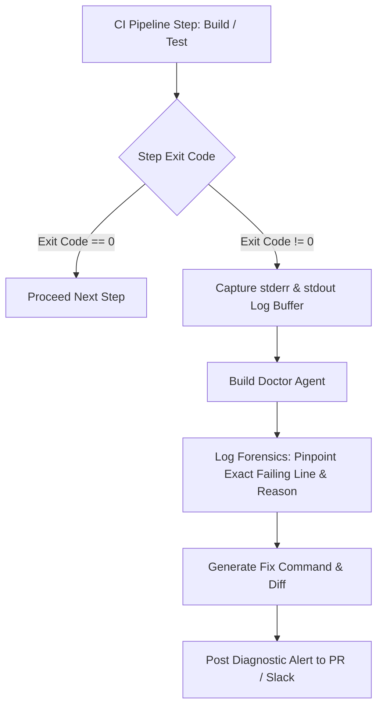

# Architectural Patterns for AI Agents in CI/CD

This document details the mental models, event triggers, and architectural flows for embedding AI agents into modern DevOps pipelines.

---

## 1. Pattern 1: The Sentinel Gate (Pre-Apply Infrastructure Safety)

### Key Capabilities:
- Ingests structured JSON AST of infrastructure changes.
- Evaluates replacement hazards on stateful resources (Databases, S3, Disks).
- Provides instant PR feedback with HCL fixes before changes reach production.

---

## 2. Pattern 2: The Contextual Triager (DevSecOps Vulnerability Noise Reducer)

### Key Capabilities:
- Aggregates multiple CVEs into a single root cause fix (e.g. 1 base image bump solves 15 CVEs).
- Filters out non-actionable upstream noise.
- Generates directly mergeable code diffs.

---

## 3. Pattern 3: The Build Doctor (Failure Interceptor & Root Cause Analyzer)

### Key Capabilities:
- Intercepts failure hooks without modifying core application code.
- Reduces MTTR (Mean Time To Recovery) from minutes to seconds.
- Eliminates developer frustration with deep dependency/compiler stack traces.
